# Convolution arithmetic

A technical report on convolution arithmetic in the context of deep learning.

## Convolution animations

_N.B.: Blue maps are inputs, and cyan maps are outputs._

<table style="width:100%">
  <tr>
    <td>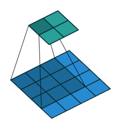</td>
    <td>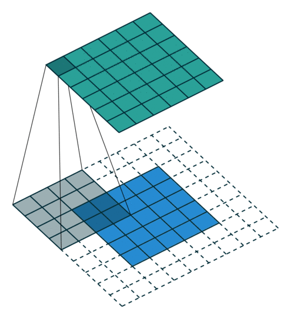</td>
    <td>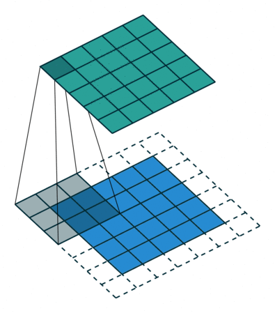</td>
    <td>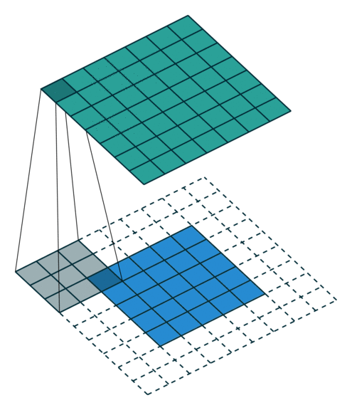</td>
  </tr>
  <tr>
    <td>No padding, no strides</td>
    <td>Arbitrary padding, no strides</td>
    <td>Half padding, no strides</td>
    <td>Full padding, no strides</td>
  </tr>
  <tr>
    <td>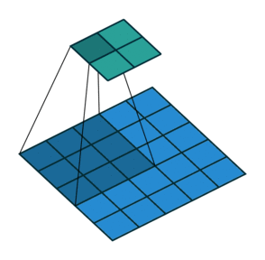</td>
    <td>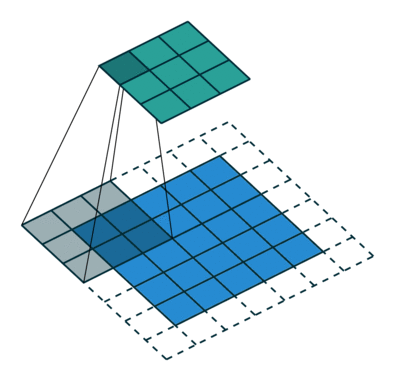</td>
    <td>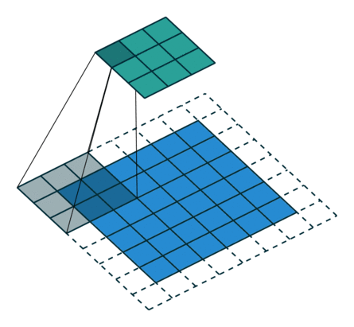</td>
    <td></td>
  </tr>
  <tr>
    <td>No padding, strides</td>
    <td>Padding, strides</td>
    <td>Padding, strides (odd)</td>
    <td></td>
  </tr>
</table>

## Transposed convolution animations

_N.B.: Blue maps are inputs, and cyan maps are outputs._

<table style="width:100%">
  <tr>
    <td>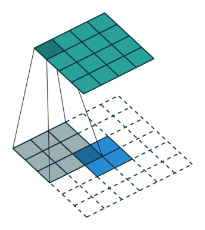</td>
    <td></td>
    <td></td>
    <td>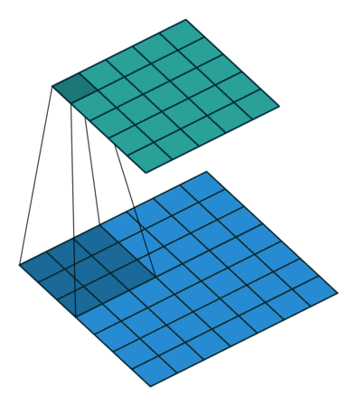</td>
  </tr>
  <tr>
    <td>No padding, no strides, transposed</td>
    <td>Arbitrary padding, no strides, transposed</td>
    <td>Half padding, no strides, transposed</td>
    <td>Full padding, no strides, transposed</td>
  </tr>
  <tr>
    <td>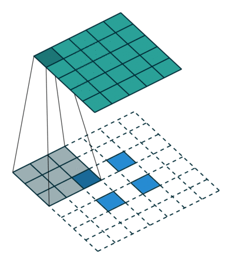</td>
    <td>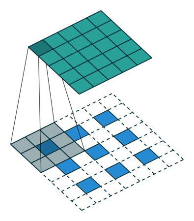</td>
    <td></td>
    <td></td>
  </tr>
  <tr>
    <td>No padding, strides, transposed</td>
    <td>Padding, strides, transposed</td>
    <td>Padding, strides, transposed (odd)</td>
    <td></td>
  </tr>
</table>

## Dilated convolution animations

_N.B.: Blue maps are inputs, and cyan maps are outputs._


<table style="width:100%">
  <tr>
    <td>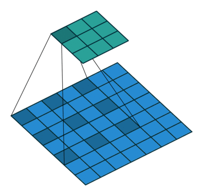</td>
    <td></td>
    <td></td>
    <td></td>
  </tr>
  <tr>
    <td>No padding, no stride, dilation</td>
    <td></td>
    <td></td>
    <td></td>
  </tr>
</table>

## Generating the Makefile

From the repository's root directory:

``` bash
$ ./bin/generate_makefile
```
## Generating the animations

From the repository's root directory:

``` bash
$ make all_animations
```

The animations will be output to the `gif` directory. Individual animation steps
will be output in PDF format to the `pdf` directory and in PNG format to the
`png` directory.

## Compiling the document

From the repository's root directory:

``` bash
$ make
```
